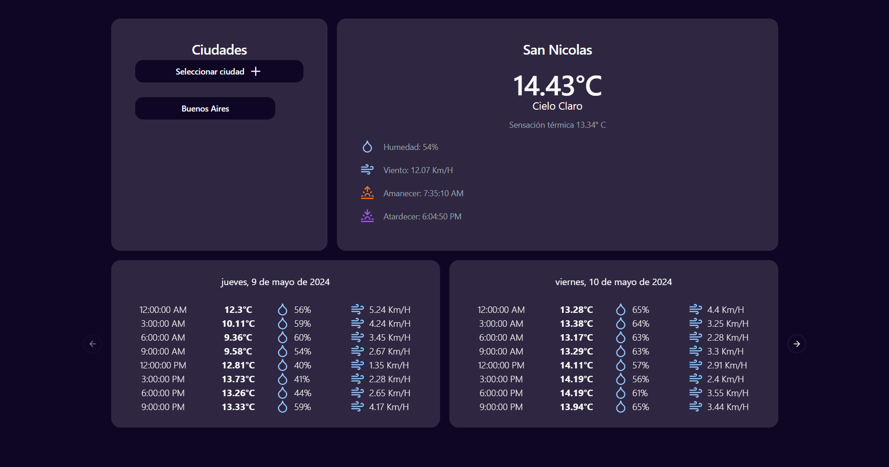

# weather-frontend

Frontend básico que consume la API de consulta de clima https://github.com/MayraUrquiza/weather-api.

Presenta de manera visual la ciudad actual de acuerdo a la ip desde la que se consulta, un selector de ciudades preestablecidas para consultar el clima de hasta cinco ciudades más, el clima actual y el pronóstico a cinco días de la ciudad seleccionada.

https://github.com/MayraUrquiza/weather-frontend



## Construido con

- React
- Redux
- Vite
- Shadcn/ui

## Como utilizarlo

### Prerequisitos

Instalar npm en caso de ser necesario

```
npm install npm@latest -g
```

### Instalación

1. Clonar el repositorio
   ```
   git clone https://github.com/MayraUrquiza/weather-frontend.git
   ```
2. Instalar paquetes de NPM
   ```
   npm install
   ```
3. Crear el archivo .env en la carpeta raíz del proyecto y setear la siguiente variable:

   ```
   VITE_WEATHER_API_BASE_URL: "http://localhost:3000/api/v1"
   ```

   **Si no se realiza este paso la url de la api tomara el valor por defecto definido en el archivo /src/config/default.ts.**

### Comandos de ejecución

- Para ejecutar el proyecto utilizar el comando `npm run dev`
- Para realizar el build del proyecto utilizar el comando `npm run build`
